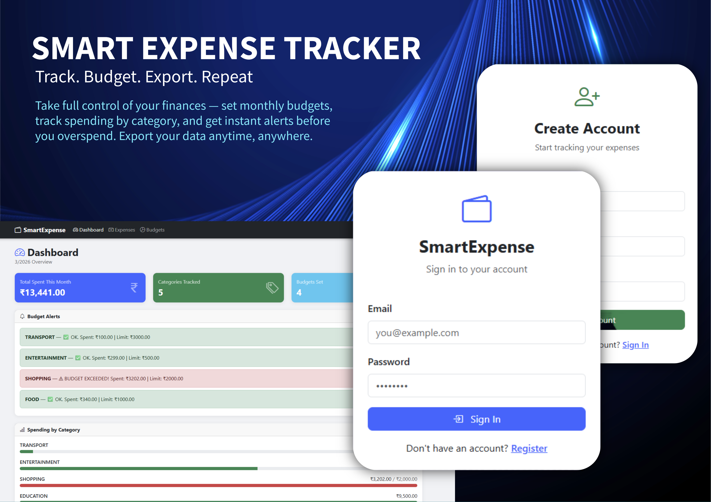

<div align="center">

# 💸 Smart Expense Tracker — Frontend

### A modern, responsive Angular 17 SPA for personal finance management

[](https://angular.io/)
[](https://www.typescriptlang.org/)
[](https://getbootstrap.com/)
[](https://rxjs.dev/)
[](https://nodejs.org/)
[](LICENSE)

<br/>

**Authenticate · Track expenses · Manage budgets · Export CSV reports**

[Getting Started](#-installation--setup) · [Screenshots](#-screenshots) · [Features](#-features) · [API Integration](#-api-integration) · [Models](#-models) · [License](#-license)

---



---

</div>

## 📋 Table of Contents

- [Overview](#-overview)
- [Tech Stack](#-tech-stack)
- [Screenshots](#-screenshots)
- [Project Structure](#-project-structure)
- [Prerequisites](#-prerequisites)
- [Installation & Setup](#-installation--setup)
- [Authentication Flow](#-authentication-flow)
- [Routes](#️-routes)
- [Features](#-features)
- [API Integration](#-api-integration)
- [Models](#-models)
- [Build for Production](#️-build-for-production)
- [Common Issues & Fixes](#-common-issues--fixes)
- [Development Notes](#-development-notes)
- [Backend](#-backend)
- [License](#-license)

---

## 🌟 Overview

**Smart Expense Tracker Frontend** is a fully-featured Single Page Application built with **Angular 17** standalone components. It connects seamlessly to the [Spring Boot REST API backend](../smart-expense-API/README.md) and provides an intuitive interface for:

- 🔐 **Secure login & registration** with JWT-based authentication
- 📊 **Real-time dashboard** with category-wise spend breakdown and visual progress bars
- 💸 **Complete expense management** — add, edit, delete, filter, and export as CSV
- 🎯 **Monthly budget tracking** with color-coded overspend alerts
- ⚡ **Instant client-side filtering** with zero extra API calls

All components are **standalone** (no NgModules), making the app lightweight and tree-shakeable. The JWT interceptor auto-attaches tokens to every outgoing request, and the Auth Guard protects all private routes.

---

## 🚀 Tech Stack

| Technology | Version | Purpose |
|---|---|---|
| Angular | 17+ | Frontend SPA framework |
| TypeScript | 5+ | Type-safe development |
| Bootstrap | 5.3 | UI components & responsive layout |
| Bootstrap Icons | 1.11 | Icon library |
| RxJS | 7+ | Reactive HTTP & state handling |
| Angular HttpClient | Built-in | REST API communication |
| JWT (localStorage) | — | Auth token storage & decoding |

---

## 🖼️ Screenshots

### 🔑 Login


---

### 📝 Register


---

### 📊 Dashboard


---

### 💸 Expenses


---

### 🎯 Budgets


---

## 📁 Project Structure

```
smart-expense-frontend/
├── src/
│   ├── app/
│   │   ├── core/
│   │   │   ├── models/
│   │   │   │   ├── expense.model.ts        # Expense DTO interface
│   │   │   │   ├── budget.model.ts         # Budget DTO interface
│   │   │   │   ├── user.model.ts           # User DTO interface
│   │   │   │   └── dashboard.model.ts      # Dashboard DTO interface
│   │   │   ├── services/
│   │   │   │   ├── auth.service.ts         # Login, register, JWT decode
│   │   │   │   ├── expense.service.ts      # Expense CRUD + CSV export
│   │   │   │   ├── budget.service.ts       # Budget CRUD
│   │   │   │   └── dashboard.service.ts    # Dashboard & alerts
│   │   │   ├── interceptors/
│   │   │   │   └── auth.interceptor.ts     # Auto-attach JWT to every request
│   │   │   └── guards/
│   │   │       └── auth.guard.ts           # Block unauthenticated route access
│   │   ├── pages/
│   │   │   ├── login/
│   │   │   │   ├── login.component.ts
│   │   │   │   └── login.component.html
│   │   │   ├── register/
│   │   │   │   ├── register.component.ts
│   │   │   │   └── register.component.html
│   │   │   ├── dashboard/
│   │   │   │   ├── dashboard.component.ts
│   │   │   │   └── dashboard.component.html
│   │   │   ├── expenses/
│   │   │   │   ├── expenses.component.ts
│   │   │   │   ├── expenses.component.html
│   │   │   │   └── expenses.component.css
│   │   │   └── budgets/
│   │   │       ├── budgets.component.ts
│   │   │       ├── budgets.component.html
│   │   │       └── budgets.component.css
│   │   ├── navbar/
│   │   │   ├── navbar.component.ts
│   │   │   └── navbar.component.html
│   │   ├── app.component.ts
│   │   ├── app.component.html
│   │   └── app.routes.ts                   # Route definitions
│   ├── assets/
│   │   └── images/
│   │       ├── posterSET.png               # App showcase poster
│   │       ├── login.png
│   │       ├── register.png
│   │       ├── dashboard.png
│   │       ├── expenses.png
│   │       └── budgets.png
│   ├── index.html
│   ├── main.ts
│   └── styles.css
├── angular.json
├── package.json
├── tsconfig.json
├── README.md
└── LICENSE
```

---

## ✅ Prerequisites

Ensure the following are installed on your machine before proceeding:

| Requirement | Minimum Version | Download |
|---|---|---|
| Node.js | 18+ | [nodejs.org](https://nodejs.org) |
| npm | 9+ | Bundled with Node.js |
| Angular CLI | 17+ | See below |

Install Angular CLI globally:

```bash
npm install -g @angular/cli
```

Verify your setup:

```bash
node -v       # v18+
npm -v        # v9+
ng version    # Angular CLI: 17+
```

> ⚠️ The **Spring Boot backend** must be running on `http://localhost:8080` before using the frontend. See the [backend README](../smart-expense-API/README.md) for setup instructions.

---

## 🔧 Installation & Setup

### 1. Clone the Repository

```bash
git clone https://github.com/your-username/SmartExpenseTracker.git
cd SmartExpenseTracker/smart-expense-frontend
```

### 2. Install Dependencies

```bash
npm install
```

### 3. Configure the Backend API URL

Open `src/app/core/services/auth.service.ts` (and other service files) and confirm or update the base URL:

```typescript
private baseUrl = 'http://localhost:8080';
```

> Change this if your backend runs on a different host or port (e.g., a deployed server URL).

### 4. Start the Development Server

```bash
ng serve
```

Open your browser at → **[http://localhost:4200](http://localhost:4200)**

The app will hot-reload automatically on any file changes.

---

## 🔐 Authentication Flow

```
┌──────────────────────────────────────────────────────────────┐
│  1. User submits login credentials                           │
│            ↓                                                 │
│  2. POST /api/auth/login → Backend validates credentials     │
│            ↓                                                 │
│  3. JWT token received in response                           │
│            ↓                                                 │
│  4. Token + userId stored in localStorage                    │
│            ↓                                                 │
│  5. AuthInterceptor attaches token as Bearer header          │
│     to every outgoing HTTP request automatically             │
│            ↓                                                 │
│  6. AuthGuard verifies token on each route navigation        │
│     → Protects /dashboard, /expenses, /budgets               │
│            ↓                                                 │
│  7. On logout → localStorage cleared → redirect to /login   │
└──────────────────────────────────────────────────────────────┘
```

### localStorage Keys

| Key | Value |
|---|---|
| `token` | The raw JWT string |
| `userId` | The authenticated user's ID |

---

## 🗺️ Routes

| Route | Component | Guard |
|---|---|---|
| `/login` | `LoginComponent` | 🌐 Public |
| `/register` | `RegisterComponent` | 🌐 Public |
| `/dashboard` | `DashboardComponent` | 🔒 AuthGuard |
| `/expenses` | `ExpensesComponent` | 🔒 AuthGuard |
| `/budgets` | `BudgetsComponent` | 🔒 AuthGuard |
| `**` (unknown) | Redirect → `/login` | — |

---

## 📦 Features

### 🔑 Authentication
- User registration with name, email, and password
- Login with JWT token stored in localStorage
- Auto-logout on token expiry or manual logout
- AuthGuard prevents unauthenticated access to private routes

---

### 📊 Dashboard
- Total amount spent in the current month
- Category-wise spending breakdown
- Visual **progress bars** per category (spent vs budget limit)
- Color-coded budget status alerts:

| Color | Status | Condition |
|---|---|---|
| 🟢 Green | Under budget | Spent < 80% of limit |
| 🟡 Yellow | Approaching limit | Spent ≥ 80% of limit |
| 🔴 Red | Budget exceeded | Spent > limit |

---

### 💰 Expense Management
- Add, edit, and delete expenses
- Fields: **Title · Amount (₹) · Category · Date · Description**
- Client-side filters:
  - 🔍 Search by title or description
  - 🏷️ Filter by category
  - 📅 Filter by date range (From → To)
- Active filter badge counter
- **Clear all filters** button
- Live record count display
- **Export all expenses as CSV** file
- Animated slim loading bar on data fetch

---

### 🎯 Budget Management
- Set a monthly spending limit per category
- Delete existing budgets
- Client-side filters:
  - 🏷️ Filter by category
  - 📅 Filter by month (full month name, e.g., "March")
  - 📆 Filter by year
- Active filter badge counter
- **Clear all filters** button

---

## 🌐 API Integration

All HTTP calls are directed to the Spring Boot backend at `http://localhost:8080`. The `AuthInterceptor` automatically attaches the JWT Bearer token to every request.

| Service | Endpoint | Method |
|---|---|---|
| Login | `/api/auth/login` | `POST` |
| Register | `/api/users/register` | `POST` |
| Get Expenses | `/api/expenses/user/{userId}` | `GET` |
| Add Expense | `/api/expenses` | `POST` |
| Update Expense | `/api/expenses/{id}` | `PUT` |
| Delete Expense | `/api/expenses/{id}` | `DELETE` |
| Export CSV | `/api/export/expenses/{userId}` | `GET` |
| Get Budgets | `/api/budgets/user/{userId}` | `GET` |
| Set Budget | `/api/budgets` | `POST` |
| Delete Budget | `/api/budgets/{id}` | `DELETE` |
| Get Dashboard | `/api/budgets/dashboard/{userId}` | `GET` |

---

## 🧩 Models

### Expense

```typescript
export interface Expense {
  id?: number;
  title: string;
  amount: number;
  category: string;
  description?: string;
  date: string;       // Format: YYYY-MM-DD
  userId: number;
}
```

### Budget

```typescript
export interface Budget {
  id?: number;
  category: string;
  monthlyLimit: number;
  month: number;      // 1–12
  year: number;
  userId: number;
}
```

### DashboardDTO

```typescript
export interface DashboardDTO {
  totalSpentThisMonth: number;
  spentByCategory:  { [key: string]: number };
  budgetByCategory: { [key: string]: number };
  budgetAlerts:     { [key: string]: string };
}
```

---

## 🛠️ Build for Production

```bash
ng build --configuration production
```

The compiled output will be placed in the `dist/smart-expense-frontend/` folder. Deploy the contents of that directory to any static host:

| Platform | Notes |
|---|---|
| **Nginx** | Point root to `dist/` folder; add `try_files $uri /index.html` for SPA routing |
| **Apache** | Use `.htaccess` with `FallbackResource /index.html` |
| **Netlify** | Drag and drop the `dist/` folder or connect your Git repo |
| **Vercel** | Import your repo; set output directory to `dist/smart-expense-frontend` |

---

## 🔧 Common Issues & Fixes

| Issue | Cause | Fix |
|---|---|---|
| `swagger-ui.html` returns 500 | Wrong Swagger URL | Use `/swagger-ui/index.html` instead |
| White text on white table | Dark theme conflict | Add `text-dark` to `<table>` or remove `data-bs-theme="dark"` from `index.html` |
| Expenses list not rendering | Change detection not triggered | `ChangeDetectorRef.detectChanges()` is called to force re-render |
| CORS error from Angular | Missing CORS config on backend | Ensure `@CrossOrigin` or `SecurityConfig` permits `localhost:4200` |
| JWT token not attached to requests | Interceptor not registered | Confirm `AuthInterceptor` is listed in `app.config.ts` providers |
| Empty page after login | Missing localStorage keys | Verify `token` and `userId` are present in browser localStorage |

---

## 🧑‍💻 Development Notes

- All components use **Angular standalone** architecture — no NgModules required
- Change detection uses `ChangeDetectionStrategy.Default` with manual `cdr.detectChanges()` calls for guaranteed UI updates
- All filters are **client-side** — instant filtering with no additional API calls
- JWT is **decoded client-side** to extract the `userId` without an extra network round-trip
- Services use `HttpClient` with `Observable` — no third-party state management library (NgRx, Akita) required
- The `AuthInterceptor` uses `HttpInterceptorFn` (functional interceptor pattern, Angular 15+)

---

## 🔗 Backend

The Spring Boot REST API that powers this frontend lives in:

```
SmartExpenseTracker/smart-expense-API/
```

| Resource | URL |
|---|---|
| Backend API | `http://localhost:8080` |
| Swagger UI | `http://localhost:8080/swagger-ui/index.html` |
| Backend README | [`smart-expense-API/README.md`](../smart-expense-API/README.md) |

---

## 📄 License

```
MIT License

Copyright (c) 2026 Thill

Permission is hereby granted, free of charge, to any person obtaining a copy
of this software and associated documentation files (the "Software"), to deal
in the Software without restriction, including without limitation the rights
to use, copy, modify, merge, publish, distribute, sublicense, and/or sell
copies of the Software, and to permit persons to whom the Software is
furnished to do so, subject to the following conditions:

The above copyright notice and this permission notice shall be included in all
copies or substantial portions of the Software.

THE SOFTWARE IS PROVIDED "AS IS", WITHOUT WARRANTY OF ANY KIND, EXPRESS OR
IMPLIED, INCLUDING BUT NOT LIMITED TO THE WARRANTIES OF MERCHANTABILITY,
FITNESS FOR A PARTICULAR PURPOSE AND NONINFRINGEMENT. IN NO EVENT SHALL THE
AUTHORS OR COPYRIGHT HOLDERS BE LIABLE FOR ANY CLAIM, DAMAGES OR OTHER
LIABILITY, WHETHER IN AN ACTION OF CONTRACT, TORT OR OTHERWISE, ARISING FROM,
OUT OF OR IN CONNECTION WITH THE SOFTWARE OR THE USE OR OTHER DEALINGS IN THE
SOFTWARE.
```

---

<div align="center">

Made with ❤️ using Angular 17 · Spring Boot 3 · MySQL · Give this repo a ⭐ if you found it useful!

</div>
